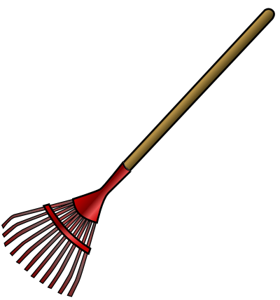

<!-- README.md is generated from README.Rmd. Please edit that file -->
redrake
=======

A simple interface to [drake for R](https://ropensci.github.io/drake/), includes a converter for [remake](https://github.com/richfitz/remake) projects.

remake + drake = redrake. Also:

<!-- Image source: https://www.wpclipart.com/tools/lawn_garden/rake/rake.png.html -->
